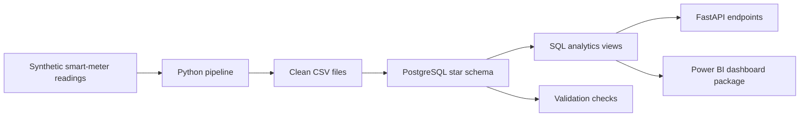

# Smart Meter Analytics

Smart Meter Analytics is a portfolio project that shows how a utility company can turn daily smart-meter readings into useful business insights.

The app simulates smart meters from homes, shops, offices, and industrial customers. It creates realistic meter readings, checks the data for problems, stores it in a database-ready star schema, exposes key numbers through a FastAPI backend, and provides a complete Power BI build package for a dashboard.

In simple terms: this project answers the question, "Are our meters working, is the data trustworthy, and what does consumption look like across customers and regions?"

## Why I Built This

I built this project to show the kind of work I want to do in a Data & Analytics student worker role: not just making charts, but building the data foundation behind them.

A dashboard is only useful if the data behind it is reliable. This project demonstrates the full path from raw meter readings to business-ready metrics:

- generating realistic data
- cleaning and validating it
- designing a PostgreSQL analytics model
- creating SQL views for reporting
- exposing KPIs through an API
- documenting how to build the Power BI dashboard

It is meant to be practical, easy to run, and understandable for both technical and business readers.

## Who This Helps

For a utility company, smart-meter data can answer important operational questions:

- Which regions use the most electricity, water, or heat?
- Which meters are not sending readings?
- How much of the data is missing or estimated?
- Which meters look unhealthy or delayed?
- Are there abnormal consumption spikes that need investigation?
- Can business users trust the dashboard numbers?

This helps operations teams find meter problems faster, helps analysts build trusted reports, and helps managers understand consumption and data quality at a glance.

## What The App Does

The project has three main parts:

1. A Python data pipeline that creates and cleans synthetic smart-meter data.
2. A PostgreSQL-ready analytics model with tables, validation checks, and reporting views.
3. A FastAPI backend and Power BI build package for business reporting.

The project works fully offline using generated data, so it does not depend on downloading a large external dataset.

## How It Works



The pipeline creates customers, meters, regions, daily readings, missing readings, duplicate readings, estimated readings, delayed readings, anomalies, and meter health scores.

The SQL layer turns that data into business-friendly views for KPIs, daily consumption, monthly consumption, regional data quality, meter health, and anomaly summaries.

The API exposes the most important information through endpoints such as:

- `/api/kpis`
- `/api/meters`
- `/api/regions/quality`
- `/api/anomalies`
- `/api/data-quality/events`

Power BI can connect either to PostgreSQL or directly to the generated CSV files.

## Example Business Metrics

- Total Consumption
- Active Meters
- Reading Success Rate
- Missing Reading %
- Anomaly Count
- Critical Meter Count
- Average Health Score
- Data Freshness Hours
- Estimated Reading %

Each metric is documented in `metric_definitions.md` so a business user can understand what it means and where it comes from.

## Tech Stack

- Python 3.12+
- pandas
- pydantic-settings
- PostgreSQL
- SQLAlchemy and psycopg2
- FastAPI and Uvicorn
- pytest and HTTPX
- Docker Compose
- SQL views and validation scripts
- Power BI-ready DAX and documentation

## Repository Structure

```text
data/                 Raw, processed, and sample CSV exports
python/               Synthetic data generation, cleaning, loading, orchestration
sql/                  PostgreSQL schema, tables, views, checks, sample queries
api/                  FastAPI app, routers, services, schemas
tests/                Offline pytest coverage
powerbi/              DAX measures and Power BI build guide
docs/                 Recruiter summary, CV bullets, interview explanation
```

## Setup

Create and activate a virtual environment:

```powershell
python -m venv .venv
.\.venv\Scripts\Activate.ps1
pip install -r requirements.txt
```

Copy the environment template:

```powershell
Copy-Item .env.example .env
```

The default setup generates:

- 1,000 customers
- 1,200 meters
- 6 Danish regions or cities
- 12 months of daily readings
- missing readings, duplicates, anomalies, inactive meters, delayed readings, and estimated readings

## Run The Data Pipeline

```powershell
python -m python.run_pipeline
```

This creates CSV files in:

- `data/processed/`
- `data/sample_exports/`

The pipeline prints a summary showing how many customers, meters, readings, missing values, anomalies, and quality events were created.

The validation summary may show duplicate readings as a finding. This is intentional because the synthetic data includes a small number of realistic data-quality issues for demonstration.

## Start The API Without Docker

This is the easiest way to test the project:

```powershell
python -m uvicorn api.main:app --reload
```

Open:

```text
http://127.0.0.1:8000/docs
```

The API can use the generated CSV files, so PostgreSQL is not required for a quick demo.

## Start PostgreSQL With Docker

If Docker Desktop is installed and running:

```powershell
docker compose up -d postgres pgadmin
```

PostgreSQL defaults:

- Host: `localhost`
- Port: `5432`
- Database: `smart_utility`
- User: `postgres`
- Password: `postgres`

pgAdmin is available at:

```text
http://localhost:5050
```

If you already have a local PostgreSQL running on port `5432`, change `POSTGRES_PORT` in `.env` to `5433`.

## Load Data Into PostgreSQL

After PostgreSQL is running:

```powershell
python -m python.run_pipeline --load-postgres
```

This creates the `utility` schema, loads the generated data, and creates the Power BI-ready SQL views.

## Run The API With Docker

```powershell
docker compose up --build api
```

The Docker API service waits for PostgreSQL, generates synthetic data, loads the database, creates SQL views, and starts FastAPI.

Set this in `.env` if you do not want Docker to reload data every time:

```env
API_AUTO_LOAD_DATA=false
```

## Run Tests

```powershell
pytest
```

The test suite checks generated data, validation logic, API contracts, and SQL view definitions. It does not require PostgreSQL by default.

## Connect Power BI

Power BI can use PostgreSQL or CSV files.

PostgreSQL option:

1. Open Power BI Desktop.
2. Select `Get data > PostgreSQL database`.
3. Server: `localhost:5432`.
4. Database: `smart_utility`.
5. Import the `utility` tables and views.
6. Follow `powerbi/semantic_model_guide.md`.

CSV option:

1. Run `python -m python.run_pipeline`.
2. Select `Get data > Text/CSV`.
3. Import files from `data/processed/`.
4. Create relationships using `powerbi/semantic_model_guide.md`.

This repository does not generate a finished `.pbix` file automatically. Instead, it provides the DAX measures, model instructions, report layout guide, metric definitions, and screenshot checklist needed to build the dashboard manually.

## What Screenshots To Add

After building the dashboard, add screenshots for:

- Executive Overview page
- Consumption Analysis page
- Meter Health & Data Quality page
- Anomaly Detection page
- Metric Definitions page
- FastAPI docs page
- Pipeline terminal summary
- Power BI model relationship view

See `powerbi/screenshot_checklist.md`.

## What This Project Shows

This project demonstrates:

- practical Python data engineering
- PostgreSQL star schema design
- SQL analytics views
- data validation and quality checks
- FastAPI backend development
- Power BI semantic model planning
- business metric documentation
- self-service BI thinking
- clear communication for technical and non-technical users

## CV Bullet Examples

- Built Smart Meter Analytics, an end-to-end utility data project using Python, PostgreSQL, SQL, FastAPI, and Power BI documentation to monitor consumption, meter health, anomalies, and data quality.
- Designed a PostgreSQL star schema and SQL reporting views for Power BI analysis across regions, customer segments, meter types, and operational KPIs.
- Implemented a synthetic smart-meter data pipeline with validation checks for duplicates, missing readings, invalid IDs, delayed readings, and anomaly consistency.
