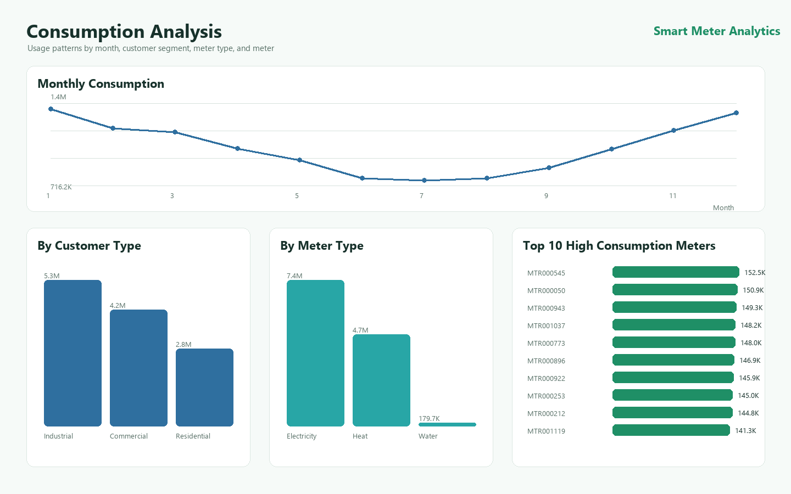
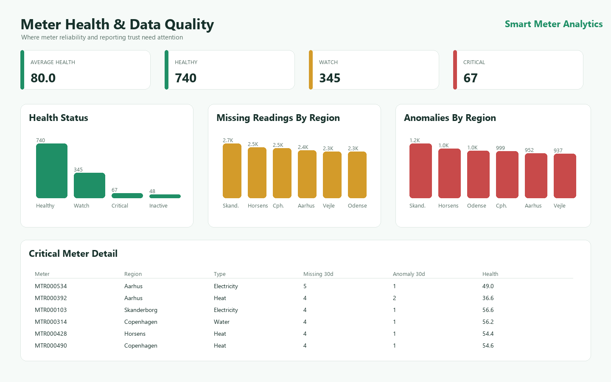
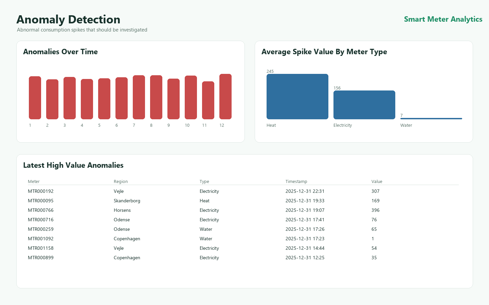
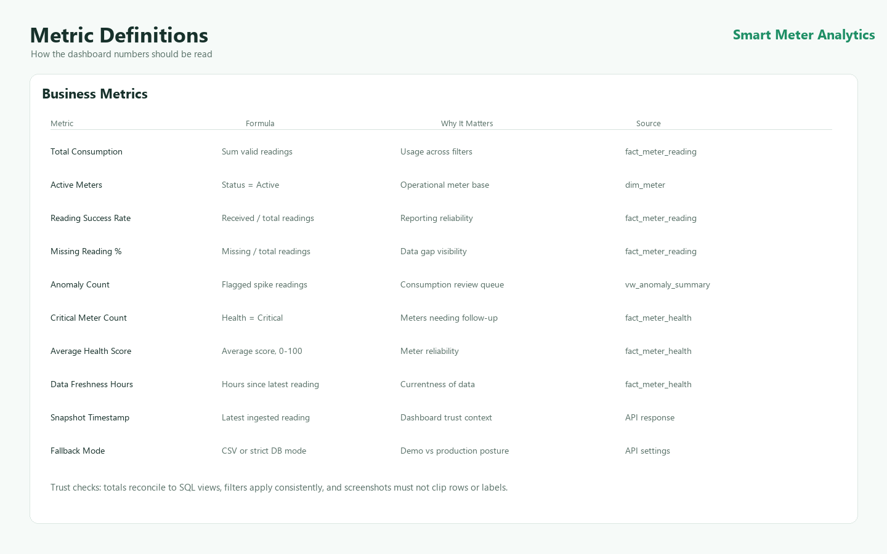
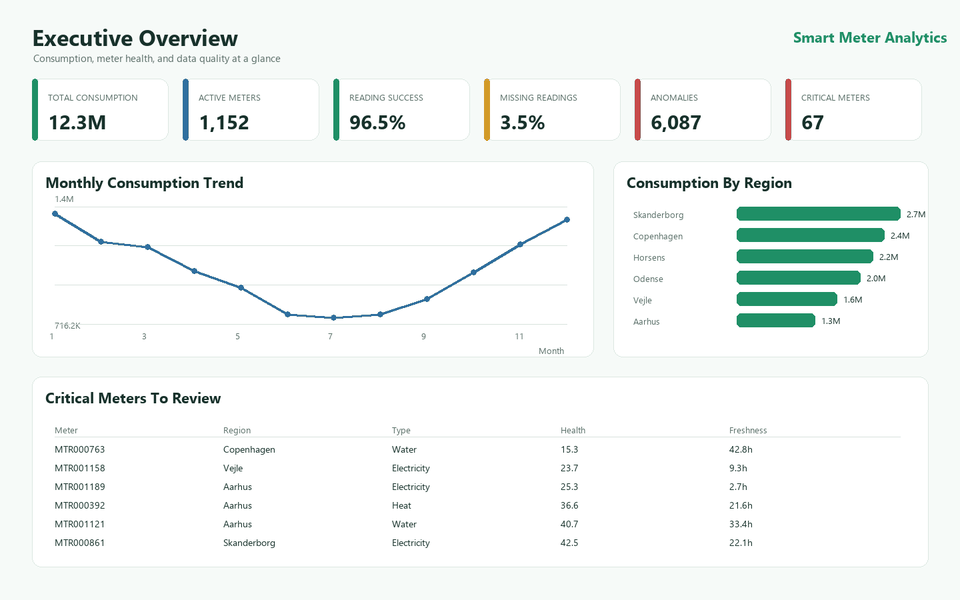
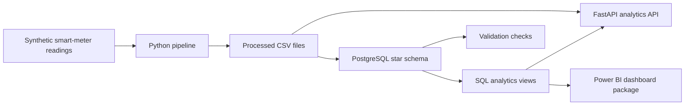

# Smart Meter Analytics

Smart Meter Analytics is an end-to-end utility data project that turns synthetic smart-meter readings into trusted operational KPIs, API endpoints, SQL reporting views, and a Power BI dashboard build package.

It answers a practical utility question: are meters reporting, is the data trustworthy, and where should operations teams focus attention?

## Project Snapshot

- Generates realistic smart-meter data for electricity, water, and heat meters.
- Cleans and validates readings with realistic issues: missing values, duplicates, delayed readings, estimates, inactive meters, and anomalies.
- Loads a PostgreSQL star schema with reporting views for KPIs, consumption trends, meter health, data quality, and anomaly triage.
- Exposes analytics through FastAPI with versioned `/api/v1` routes and CSV fallback for local demos.
- Provides Power BI-ready DAX, semantic model guidance, report layout notes, and generated GitHub preview media.
- Runs offline with generated data, so no external dataset is required.

## Dashboard Preview

The image below is generated from the same processed CSV data used by the project. It is GitHub preview media, not a replacement for the real Power BI Desktop build described in `powerbi/`.


### Preview Gallery

| Consumption Analysis | Meter Health & Data Quality |
|---|---|
|  |  |

| Anomaly Detection | Metric Definitions |
|---|---|
|  |  |

### Demo GIF



## Architecture



The API can read from PostgreSQL when available. For lightweight local demos, it can fall back to generated CSV files.

## What This Demonstrates

- Data generation and cleaning with Python and pandas.
- Dimensional modeling for analytics.
- PostgreSQL DDL, indexes, validation checks, and reporting views.
- FastAPI service design with health checks, versioned routes, filters, pagination, and fallback behavior.
- Business metric documentation and dashboard planning.
- CI coverage for the pipeline, SQL contracts, API behavior, and generated preview media.

## Latest API Improvements

The API now includes a more production-shaped surface while keeping the demo easy to run.

**Health**

- `GET /health/liveness` - process is up.
- `GET /health/readiness` - checks database readiness. In `demo_fallback` mode, unavailable Postgres returns a degraded response and CSV fallback can still serve demo data. In `strict_db` mode, database failure returns HTTP 503.

**Versioned routes**

- `GET /api/v1/kpis` - executive KPI summary.
- `GET /api/v1/meters` - meter list with `meter_type`, `region`, `health_status`, `limit`, and `offset`.
- `GET /api/v1/meters/{meter_id}` - meter detail.
- `GET /api/v1/regions/quality` - regional data-quality summary.
- `GET /api/v1/anomalies` - anomaly list with date range, region, customer type, meter type, reason, limit, and offset filters.
- `GET /api/v1/data-quality/events` - data-quality events with semantic severity ordering and pagination.
- `GET /api/v1/consumption/time-series` - daily or monthly consumption aggregates with date range, region, customer type, meter type, limit, and offset filters.

Legacy aliases such as `/api/kpis`, `/api/meters`, and `/api/consumption/time-series` remain available for demo compatibility.

## Data Model

The PostgreSQL layer uses a star schema:

- `dim_date`
- `dim_region`
- `dim_customer`
- `dim_meter`
- `fact_meter_reading`
- `fact_meter_health`
- `fact_data_quality_event`

Reporting views include:

- `vw_executive_kpis`
- `vw_daily_consumption`
- `vw_monthly_consumption`
- `vw_meter_health`
- `vw_region_data_quality`
- `vw_anomaly_summary`

The schema name is configurable through `DB_SCHEMA` and defaults to `utility`.

## Example Business Metrics

- Total Consumption
- Active Meters
- Reading Success Rate
- Missing Reading %
- Anomaly Count
- Critical Meter Count
- Average Health Score
- Data Freshness Hours
- Estimated Reading %

Metric definitions are documented in `metric_definitions.md`.

## Tech Stack

- Python 3.12+
- pandas and numpy
- PostgreSQL
- SQLAlchemy and psycopg2
- FastAPI and Uvicorn
- pydantic-settings
- pytest and HTTPX
- Docker Compose
- Power BI-ready DAX and documentation
- Pillow for generated dashboard preview media

## Repository Structure

```text
api/                  FastAPI app, routers, schemas, and services
data/                 Raw, processed, and sample export folders
docs/                 Portfolio summaries and generated preview assets
powerbi/              DAX, semantic model guide, layout guide, preview generator
python/               Data generation, cleaning, loading, and orchestration
sql/                  Schema, tables, views, validation checks, sample queries
tests/                Offline pytest coverage
.github/workflows/    CI workflow
```

## Setup

Create and activate a virtual environment:

```powershell
python -m venv .venv
.\.venv\Scripts\Activate.ps1
pip install -r requirements.txt
```

Copy the environment template:

```powershell
Copy-Item .env.example .env
```

Important environment settings:

- `DB_SCHEMA=utility` - PostgreSQL schema used for tables and views.
- `API_DB_MODE=demo_fallback` - use CSV fallback when database queries fail. Set `strict_db` for production-like 503 behavior.
- `API_AUTO_LOAD_DATA=true` - Docker API startup can regenerate and load data automatically.
- `POSTGRES_PASSWORD=postgres` and `PGADMIN_DEFAULT_PASSWORD=admin` - development defaults only. Replace them outside local demos.

## Run The Data Pipeline

```powershell
python -m python.run_pipeline
```

This creates processed CSV files in:

- `data/processed/`
- `data/sample_exports/`

The default data set contains 1,000 customers, 1,200 meters, 12 months of daily readings, and realistic data-quality issues for demonstration.

## Start The API Without Docker

```powershell
python -m uvicorn api.main:app --reload
```

Open the interactive API docs:

```text
http://127.0.0.1:8000/docs
```

PostgreSQL is optional for a quick demo because the API can serve from processed CSV files in `demo_fallback` mode.

## Start PostgreSQL With Docker

```powershell
docker compose up -d postgres
```

PostgreSQL defaults:

- Host: `localhost`
- Port: `5432`
- Database: `smart_utility`
- User: `postgres`
- Password: `postgres`

pgAdmin is optional and runs under the `tools` profile:

```powershell
docker compose --profile tools up -d postgres pgadmin
```

pgAdmin is then available at:

```text
http://localhost:5050
```

## Load Data Into PostgreSQL

```powershell
python -m python.run_pipeline --load-postgres
```

This creates the configured schema, loads generated CSV data, and creates the reporting views.

## Run The API With Docker

```powershell
docker compose up --build api
```

The API service waits for Postgres, optionally generates and loads data, and starts FastAPI on port `8000`.

## Run Tests

```powershell
pytest
```

The tests cover:

- Data generation behavior.
- Validation logic.
- SQL contract checks.
- API contracts and CSV fallback behavior.
- Configurable schema safeguards.
- Data-quality severity ordering.
- Generated dashboard preview media.

CI runs the pipeline and test suite on pushes and pull requests to `main` or `master`.

## Connect Power BI

Power BI can use PostgreSQL or CSV files.

PostgreSQL option:

1. Open Power BI Desktop.
2. Select `Get data > PostgreSQL database`.
3. Server: `localhost:5432`.
4. Database: `smart_utility`.
5. Select the configured schema, usually `utility`.
6. Follow `powerbi/semantic_model_guide.md`.

CSV option:

1. Run `python -m python.run_pipeline`.
2. Select `Get data > Text/CSV`.
3. Import files from `data/processed/`.
4. Create relationships using `powerbi/semantic_model_guide.md`.

This repository does not generate a finished `.pbix` file automatically. It provides DAX measures, model instructions, page layout guidance, metric definitions, and screenshot guidance for manually building the Power BI report.

## Regenerate Preview Media

If the generated data or dashboard preview script changes, refresh the README images:

```powershell
python powerbi/generate_dashboard_media.py
```

The script creates PNG previews in `docs/assets/screenshots/` and a short GIF in `docs/assets/demo/`.

## Production Readiness Notes

This is a portfolio project with several production-oriented improvements already started. Remaining next steps include:

- Add authentication and authorization before exposing the API beyond localhost.
- Run the API container as a non-root user.
- Add a migration runner for schema upgrades instead of direct SQL apply order.
- Add caching or precomputed aggregate files for hot read endpoints and CSV fallback performance.
- Add structured request logging, correlation IDs, and basic API metrics.
- Continue polishing the real Power BI `.pbix` report separately from generated GitHub preview media.

## What Screenshots To Capture

After building the real Power BI dashboard, capture:

- Executive Overview.
- Consumption Analysis.
- Meter Health & Data Quality.
- Anomaly Detection.
- Metric Definitions.
- Power BI model relationship view.
- FastAPI Swagger/OpenAPI docs.
- Pipeline terminal summary.

See `powerbi/screenshot_checklist.md`.

## CV Bullet Examples

- Built Smart Meter Analytics, an end-to-end utility data project using Python, PostgreSQL, SQL, FastAPI, and Power BI documentation to monitor consumption, meter health, anomalies, and data quality.
- Designed a PostgreSQL star schema and SQL reporting views for Power BI analysis across regions, customer segments, meter types, and operational KPIs.
- Implemented a synthetic smart-meter data pipeline with validation checks for duplicates, missing readings, invalid IDs, delayed readings, anomaly consistency, and meter health scoring.
